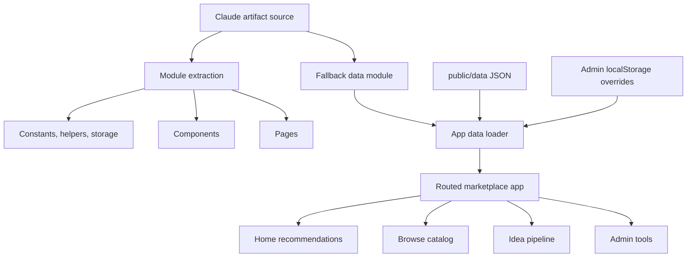
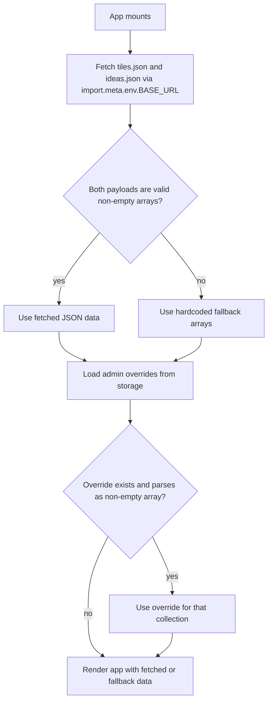

# feat: Migrate Claude artifact into CEG AI Marketplace

## Summary

Migrate the existing Claude artifact into the `ceg-ai-marketplace` Vite React app as a lift-and-shift implementation, then layer in the strongest marketplace-shell ideas from the current scaffold where they fill gaps without changing core behavior. The main product change is data loading: catalog tiles and seeded ideas move from inline arrays to runtime JSON under `public/data/`, with hardcoded fallbacks and local admin overrides preserved.

---

## Problem Frame

The current repository contains a starter marketplace shell, but the real product surface already exists as a working Claude artifact. The implementation should not redesign that artifact from scratch; it should preserve the artifact's behavior while making it maintainable, deployable on GitHub Pages, and easier to update through committed data files. The migration also needs to standardize naming on `ceg-ai-marketplace`, replacing the older `ceg-ai-storefront` wording and `/ceg-ai-storefront/` base path from the source spec.

---

## Requirements

**Artifact migration and behavior preservation**

- R1. The migrated app preserves the Claude artifact's major pages and flows: home recommendations, browse catalog, idea pipeline, admin unlock, admin catalog import/export, admin ideas import/export, voting, and tile detail viewing.
- R2. Artifact logic is lifted into maintainable modules without intentional behavior rewrites, except where this plan explicitly calls out deployment-environment changes.
- R3. `window.storage` usage is replaced with an async localStorage shim that keeps the artifact's `get`, `set`, and `delete` call shape, including the unused shared flag.
- R4. Direct Anthropic browser calls fail gracefully with a visible "AI search is not available in this environment" state and a path back to Claude; no API key or proxy is added in this pass.

**Runtime data and admin overrides**

- R5. Catalog tiles load from `public/data/tiles.json` at runtime and fall back to a hardcoded `TILES_FALLBACK` array if fetch, parsing, or validation fails.
- R6. Seeded ideas load from `public/data/ideas.json` at runtime and fall back to a hardcoded `IDEAS_FALLBACK` array if fetch, parsing, or validation fails.
- R7. Admin storage overrides still take precedence over fetched JSON for both catalog tiles and seeded ideas.
- R8. JSON data files preserve the artifact's tile and idea field shapes, including valid type/status values, and omit fields that are functions or undefined.

**Marketplace shell and naming**

- R9. The app consistently uses `CEG AI Marketplace`, `ceg-ai-marketplace`, and `/ceg-ai-marketplace/` in source, configuration, documentation, and deployment acceptance criteria.
- R10. The migrated UI may incorporate the current scaffold's best marketplace-shell ideas: a clearer enterprise browsing posture, stronger category/search affordances, trust/governance cues, and selected-item detail emphasis. These additions must reuse artifact data or existing metadata and must not invent new product concepts that require new backend data.
- R11. The app remains responsive, with no page-level horizontal overflow on desktop or mobile.

**Deployment and documentation**

- R12. GitHub Pages deployment builds the Vite app from `main` and publishes `dist/` using the official GitHub Pages Actions workflow.
- R13. Vite's base path is set for the actual repository path: `/ceg-ai-marketplace/`.
- R14. README documentation explains the app, local development, live URL, JSON update workflow, JSON schemas, architecture, and known limitations.

---

## High-Level Technical Design





---

## Output Structure

The implementation should converge on this repo shape. Exact grouping can adjust during implementation if import boundaries make a small change cleaner, but the plan expects the artifact to be decomposed rather than kept as a 2,100-line root component.

```text
.
├── .env.example
├── .github/
│   └── workflows/
│       └── deploy.yml
├── docs/
│   └── reference/
│       ├── CLAUDE_CODE_SPEC.md
│       └── ceg-ai-storefront.jsx
├── public/
│   └── data/
│       ├── ideas.json
│       └── tiles.json
├── src/
│   ├── App.jsx
│   ├── constants.js
│   ├── data-fallback.js
│   ├── helpers.js
│   ├── main.jsx
│   ├── storage.js
│   ├── components/
│   │   ├── Callout.jsx
│   │   ├── IdeaStatusBadge.jsx
│   │   ├── SNSearchCard.jsx
│   │   ├── Sidebar.jsx
│   │   ├── Sparkle.jsx
│   │   ├── SubLabel.jsx
│   │   ├── TagPill.jsx
│   │   ├── TileCard.jsx
│   │   └── TileModal.jsx
│   ├── pages/
│   │   ├── PageAdmin.jsx
│   │   ├── PageBrowse.jsx
│   │   ├── PageHome.jsx
│   │   ├── PageIdeaPortal.jsx
│   │   └── pipeline/
│   │       └── DiscoverySubmit.jsx
│   └── test/
│       └── setup.js
└── tests/
    ├── app-data-loading.test.jsx
    ├── helpers.test.js
    ├── page-admin.test.jsx
    └── page-idea-portal.test.jsx
```

---

## Key Technical Decisions

- **Target the actual repo name everywhere:** Use `ceg-ai-marketplace` for package naming, Vite base path, README live URL, and Pages expectations. The source spec's `ceg-ai-storefront` references are historical naming, not the target.
- **Favor artifact behavior over the starter scaffold:** The current scaffold is useful visual direction, but the Claude artifact is the working reference implementation. Scaffold ideas should enter as style and information-architecture improvements only when they do not require new data fields or workflow changes.
- **Use JavaScript/JSX for the migrated artifact:** Keep the migration close to the source artifact and spec by replacing the current TypeScript starter files with JSX modules. TypeScript can be a later hardening pass after the artifact is stable in GitHub Pages.
- **Adopt official GitHub Pages Actions:** Use `actions/configure-pages`, `actions/upload-pages-artifact`, and `actions/deploy-pages` instead of branch-publishing through `peaceiris/actions-gh-pages`. GitHub and Vite's current Pages guidance both point to the official artifact deployment flow for Vite build output.
- **Keep static JSON as the source of updateable catalog data:** Runtime JSON fetches let data changes redeploy through normal commits without source edits. Admin localStorage remains a browser-local override layer for testing or temporary operations, not a shared backend.
- **Treat AI search as unavailable in static production:** Direct calls to Anthropic's API are not viable from a static browser deployment due to auth and CORS. This pass should preserve the user flow but expose a graceful unavailable state and TODOs for a future proxy.
- **Add focused tests during migration:** The source spec has manual acceptance criteria, but this migration touches parsing, data fallback, storage overrides, and admin behavior. Add Vitest/Testing Library coverage where it reduces regression risk without turning the lift-and-shift into a rewrite.

---

## Implementation Units

### U1. Preserve Source Inputs and Reset Project Shape

**Goal:** Capture the source artifact/spec inside the repo for traceability, then align the project with a JavaScript Vite React artifact migration.

**Requirements:** R1, R2, R9

**Dependencies:** None

**Files:**

- `docs/reference/CLAUDE_CODE_SPEC.md`
- `docs/reference/ceg-ai-storefront.jsx`
- `package.json`
- `package-lock.json`
- `vite.config.js`
- `vite.config.ts`
- `tsconfig.json`
- `tsconfig.app.json`
- `tsconfig.node.json`
- `index.html`
- `src/main.jsx`
- `src/main.tsx`
- `src/App.tsx`
- `src/App.css`
- `src/index.css`

**Approach:** Copy the external source inputs into `docs/reference/` so future implementers and reviewers can inspect the exact migration source without relying on a Downloads folder. Convert the starter repo from the current TypeScript scaffold to a JavaScript Vite app by replacing TS entry points with JSX entry points. Keep package naming as `ceg-ai-marketplace`; retain useful dev scripts, and add a test script/dependencies in the implementation pass. Remove starter-only React/Vite demo assets when no longer referenced.

**Patterns to follow:** Existing `package.json` already establishes Vite, React, and npm scripts. Preserve the simple Vite app posture, but switch from scaffold UI to artifact-driven app structure.

**Test scenarios:**

- Test expectation: none -- this unit is project scaffolding and source preservation. Behavioral tests begin once helpers, data loading, and pages exist.

**Verification:** The repo contains source reference files, JS entry points are the active app entry, obsolete TS config is removed or no longer used, and the app still has a coherent package/build configuration.

### U2. Extract Constants, Helpers, Storage, and Fallback Data

**Goal:** Move artifact constants and pure logic into stable modules, with JSON-compatible catalog and idea fallback data.

**Requirements:** R2, R3, R5, R6, R8

**Dependencies:** U1

**Files:**

- `src/constants.js`
- `src/helpers.js`
- `src/storage.js`
- `src/data-fallback.js`
- `public/data/tiles.json`
- `public/data/ideas.json`
- `tests/helpers.test.js`

**Approach:** Lift module-level constants from the artifact into `src/constants.js`, except `TILES` and `SEEDED_IDEAS`, which move to fallback exports and JSON files. Keep `sortCatalogTiles`, `filterCatalogByQuery`, `normalizeIdeaStatus`, and `parseUnifiedSearch` behavior unchanged. Replace `window.storage` with an imported async localStorage shim. Extract `TILES` into `public/data/tiles.json` and `TILES_FALLBACK`; extract `SEEDED_IDEAS` into `public/data/ideas.json` and `IDEAS_FALLBACK`. Preserve field names exactly and normalize only where JSON requires it, such as resolving constant-backed URLs into string values.

**Execution note:** Add helper characterization tests before refactoring helper logic so the artifact's current sort/filter/parse behavior stays pinned.

**Patterns to follow:** The source artifact's helper definitions and constants are the behavior reference. Use the spec's `storage.js` API shape exactly, including the ignored shared parameter.

**Test scenarios:**

- Given mixed tile types, when `sortCatalogTiles` runs, then `in-platform` tiles sort before `enterprise-skill`, `local-skill`, and `automated`, with name sorting inside type groups.
- Given an empty catalog query, when `filterCatalogByQuery` runs, then the original tile list is returned without filtering.
- Given a query matching a tile name, description, use case, category, or id, when `filterCatalogByQuery` runs, then that tile is included.
- Given legacy idea statuses `planned`, `in-progress`, and `shipped`, when `normalizeIdeaStatus` runs, then they map to `committed`, `committed`, and `delivered`.
- Given AI output using either `{ catalog: [] }` or legacy `{ recommendations: [] }`, when `parseUnifiedSearch` runs, then it returns normalized `catalog` and `ideas` arrays.
- Given malformed AI output, when `parseUnifiedSearch` runs, then it returns empty arrays without throwing.

**Verification:** Constants import cleanly, JSON files are valid arrays, fallback arrays contain the same catalog/idea records as the artifact, and helper tests pass.

### U3. Extract Reusable Components and Marketplace Shell Styling

**Goal:** Decompose artifact UI primitives and tile/detail components while carrying forward the best scaffold shell ideas without inventing new product behavior.

**Requirements:** R1, R2, R10, R11

**Dependencies:** U2

**Files:**

- `src/components/Callout.jsx`
- `src/components/TagPill.jsx`
- `src/components/SubLabel.jsx`
- `src/components/Sparkle.jsx`
- `src/components/SNSearchCard.jsx`
- `src/components/IdeaStatusBadge.jsx`
- `src/components/TileCard.jsx`
- `src/components/TileModal.jsx`
- `src/components/Sidebar.jsx`
- `src/index.css`

**Approach:** Lift each component from the artifact as a named export or default export matching the spec. Replace inline references to globals with imports from constants, helpers, or sibling components. Standardize visible naming on `CEG AI Marketplace`. Use the starter scaffold as a design reference for a lighter enterprise shell, clearer nav affordances, selected/hover states, and trust/governance language where it can be expressed with existing artifact metadata such as type, status, and category. Do not add new owner/risk/install fields to tiles in this migration.

**Patterns to follow:** The artifact's component behavior, especially `TileCard`, `TileModal`, `SNSearchCard`, and `Sidebar`, remains the source of truth. The current scaffold's `src/App.tsx` and `src/App.css` are only visual references for enterprise density, search/filter ergonomics, and governance framing.

**Test scenarios:**

- Test expectation: none -- this unit is component extraction and styling. Feature behavior is covered through page and app-level tests in later units.

**Verification:** Components render through page consumers without missing imports, visible app naming says Marketplace, no starter-only fake catalog data remains, and desktop/mobile layout has no page-level overflow.

### U4. Rebuild Pages with Preserved Artifact Flows

**Goal:** Move artifact pages into page modules and preserve the main user flows for home, browse, idea pipeline, discovery submission, and admin.

**Requirements:** R1, R2, R3, R4, R7, R10, R11

**Dependencies:** U2, U3

**Files:**

- `src/pages/PageHome.jsx`
- `src/pages/PageBrowse.jsx`
- `src/pages/PageAdmin.jsx`
- `src/pages/PageIdeaPortal.jsx`
- `src/pages/pipeline/DiscoverySubmit.jsx`
- `tests/page-admin.test.jsx`
- `tests/page-idea-portal.test.jsx`

**Approach:** Lift the page-level artifact components into their target modules. Replace all `window.storage?.get/set/delete` calls with the imported storage shim. In `PageHome` and `DiscoverySubmit`, preserve AI recommendation/search flows but set an `_error` marker or equivalent explicit unavailable state on failed Anthropic calls, then render the visible static-deployment message and Claude link. Keep admin passcode behavior, catalog/idea import diff-preview/apply behavior, JSON export downloads, idea voting, and local submission storage behavior.

**Execution note:** Add characterization tests around admin and idea-pipeline behavior before making broad JSX extraction changes when practical.

**Patterns to follow:** Artifact sections around `PageHome`, `DiscoverySubmit`, `PageIdeaPortal`, and `PageAdmin` are the behavior source. The source spec's Known Gap section governs Anthropic error handling.

**Test scenarios:**

- Given the admin page is locked, when the user enters the wrong passcode, then the page shows the incorrect-passcode error and does not expose catalog tools.
- Given the admin page is locked, when the user enters `ceg2026`, then catalog and ideas management controls become available.
- Given valid catalog JSON is pasted into admin import, when the user applies it, then `onCatalogUpdate` receives the parsed array and the storage shim is updated.
- Given invalid catalog JSON is pasted into admin import, when preview/apply is attempted, then the page surfaces an error and does not call `onCatalogUpdate`.
- Given a seeded idea with no prior vote, when the user upvotes it, then the vote count increments and the user cannot vote the same idea again in that browser state.
- Given stored user votes exist, when the idea portal loads, then already-voted ideas render disabled vote affordances.
- Given an Anthropic call fails in home search, when the user submits a recommendation query, then the page displays the AI-unavailable state rather than silently showing empty results.
- Given an Anthropic call fails in discovery submission, when the user checks the catalog, then the page displays the AI-unavailable state and still offers the non-AI submission path.

**Verification:** The artifact's page flows remain reachable through the sidebar, admin storage interactions work through the shim, AI failure states are visible, and tests cover admin/voting/error behavior.

### U5. Implement App Data Loading, Routing, and Override Precedence

**Goal:** Slim `App.jsx` into the routing and data orchestration layer described by the spec.

**Requirements:** R1, R5, R6, R7, R9, R11

**Dependencies:** U2, U3, U4

**Files:**

- `src/App.jsx`
- `tests/app-data-loading.test.jsx`

**Approach:** Use `import.meta.env.BASE_URL` to fetch `data/tiles.json` and `data/ideas.json` so local dev, preview, and GitHub Pages all use the same path logic. Validate fetched payloads as non-empty arrays before accepting them. Fall back to `TILES_FALLBACK` and `IDEAS_FALLBACK` independently when fetch or validation fails. After base data resolves, load admin overrides from storage and let valid overrides replace the fetched/fallback collection. Preserve the artifact's page state and `storefront:nav` event behavior unless implementation chooses to rename the event to `marketplace:nav` and updates all call sites together; the event name is internal, so stability matters more than cosmetics.

**Technical design:** Directional state precedence, not implementation code:

```text
base tiles = valid fetched tiles or tiles fallback
base ideas = valid fetched ideas or ideas fallback
live tiles = valid stored catalog override or base tiles
live ideas = valid stored idea override or base ideas
render only after data and override checks complete
```

**Patterns to follow:** The spec's data-fetch section and the artifact's current `App` routing/storage load behavior.

**Test scenarios:**

- Given successful JSON fetches for tiles and ideas, when the app loads, then pages receive the fetched arrays and not fallback data.
- Given `tiles.json` fetch fails but `ideas.json` succeeds, when the app loads, then tiles use fallback data while ideas use fetched data.
- Given fetched JSON is not a non-empty array, when the app loads, then that collection uses fallback data.
- Given a valid catalog override exists in storage, when fetched JSON also succeeds, then the catalog uses the storage override.
- Given a valid ideas override exists in storage, when fetched JSON also succeeds, then ideas use the storage override.
- Given the app is still resolving data, when it first renders, then a centered "Loading catalog..." state appears.
- Given a `storefront:nav` event is dispatched for `submit`, when the app receives it, then the Pipeline page is shown.

**Verification:** App data precedence matches the spec, loading state appears briefly, all pages receive live data, and app-level tests cover fetch success/failure and override ordering.

### U6. Configure GitHub Pages Deployment and Documentation

**Goal:** Make the migrated marketplace buildable, previewable, deployable, and maintainable through documentation.

**Requirements:** R9, R12, R13, R14

**Dependencies:** U1, U2, U3, U4, U5

**Files:**

- `vite.config.js`
- `.github/workflows/deploy.yml`
- `.env.example`
- `README.md`
- `package.json`

**Approach:** Set Vite base to `/ceg-ai-marketplace/`. Add a GitHub Pages workflow using official Pages actions, with npm install/build, artifact upload from `dist/`, and Pages deployment on pushes to `main` plus manual dispatch. Document that the repository's Pages source must be set to GitHub Actions. Update README with Marketplace naming, live URL, local development, data update workflows, tile/idea JSON schemas, known limitations, and a brief architecture note. Add `.env.example` for the future API proxy URL without introducing secrets.

**Patterns to follow:** Current Vite static deploy docs for GitHub Pages base path and official workflow shape; GitHub Pages custom workflow docs for permissions, artifact upload, and deploy job requirements.

**Test scenarios:**

- Test expectation: none -- deployment configuration is verified through build artifacts and GitHub Actions status rather than unit tests.

**Verification:** Production build emits `dist/`, `dist/data/tiles.json`, and `dist/data/ideas.json`; the workflow succeeds after push; the deployed URL under `/ceg-ai-marketplace/` loads without asset path failures; README reflects the final repo/base path and known limitations.

### U7. Final Migration Verification and Visual Pass

**Goal:** Validate the migrated app against the source spec's acceptance criteria and the marketplace-shell quality bar.

**Requirements:** R1, R4, R5, R6, R7, R9, R10, R11, R12, R14

**Dependencies:** U1, U2, U3, U4, U5, U6

**Files:**

- `README.md`
- `docs/reference/CLAUDE_CODE_SPEC.md`

**Approach:** Use the source spec's acceptance criteria as the final checklist, adjusted for `ceg-ai-marketplace` naming and the official Pages workflow. Add a small migration note to README or a reference doc if implementation reveals intentional deviations from the artifact, especially around AI-unavailable behavior and any shell/styling enhancements brought forward from the starter scaffold.

**Patterns to follow:** Source spec acceptance criteria, with current repo naming substituted consistently.

**Test scenarios:**

- Test expectation: none -- this is final acceptance and visual verification across the already-tested app.

**Verification:** Local build and preview pass, JSON data appears in `dist/data/`, key pages and admin flows work in preview, missing JSON falls back without crash, desktop and mobile screenshots show no layout overflow, GitHub Actions deploys green, and deployed hard refreshes do not 404.

---

## Scope Boundaries

### In Scope

- Migrating the Claude artifact into this repo as the primary app.
- Standardizing all app/deploy references on `ceg-ai-marketplace`.
- Runtime JSON data loading with fallback arrays.
- LocalStorage shim and local admin overrides.
- Visible AI-unavailable states for static deployment.
- Official GitHub Pages deployment.
- Focused regression tests around helpers, data loading, admin, and voting behavior.
- Shell polish inspired by the starter scaffold when it fits existing artifact data and does not create new product obligations.

### Deferred to Follow-Up Work

- Anthropic API proxy or serverless backend for real production AI recommendations.
- Shared backend database for cross-user votes, idea submissions, and admin edits.
- Azure AD, SSO, or role-based admin auth.
- TypeScript conversion after the lift-and-shift is stable.
- New tile fields such as owner, risk level, install count, or governance review queue, unless the data model is formally extended.
- A full design-system rewrite beyond the targeted shell polish in this migration.

---

## System-Wide Impact

This migration changes the app from a starter scaffold to a static, deployable product surface. Data becomes partly content-managed through committed JSON files, while admin overrides remain browser-local. Deployment moves from an unconfigured Vite app to GitHub Pages, which means asset URLs, data fetch paths, and hard-refresh behavior depend on the `/ceg-ai-marketplace/` base path being correct.

---

## Risks & Dependencies

- **Artifact extraction drift:** The largest risk is changing working artifact behavior while splitting modules. Mitigate with characterization tests around helpers and the most stateful admin/pipeline flows.
- **Data extraction mistakes:** Manual extraction of large arrays can drop fields or break JSON. Mitigate by validating JSON, checking representative tile/idea counts, and comparing field coverage against the source artifact.
- **Static AI limitation:** Users may expect AI search to work because it worked in Claude artifacts. Mitigate with visible unavailable states, README limitations, and TODOs at call sites for a future proxy.
- **GitHub Pages setup outside code:** The workflow requires repo Pages source to be set to GitHub Actions. Document this clearly because it is a repository setting, not only a committed file.
- **Visual polish scope creep:** Pulling in scaffold ideas can accidentally become a redesign. Limit this pass to shell clarity and existing metadata presentation.

---

## Acceptance Examples

- AE1. Given `public/data/tiles.json` contains a new tile with id `test-fetch-tile`, when the app is built and previewed, then Browse Catalog shows that tile without source-code edits.
- AE2. Given `public/data/tiles.json` is missing or invalid, when the app is built and previewed, then the catalog renders from fallback data and does not crash.
- AE3. Given an admin catalog override is applied, when the user navigates back to Browse Catalog in the same browser, then the overridden catalog appears instead of fetched JSON data.
- AE4. Given the user searches with AI in static preview and the Anthropic call fails, when the failure is caught, then the app displays the AI-unavailable message and does not silently show a blank recommendation state.
- AE5. Given the deployed app URL is `https://jonhighsn.github.io/ceg-ai-marketplace/`, when a user hard-refreshes, then the app shell and static assets load without a 404 caused by an incorrect Vite base path.

---

## Documentation / Operational Notes

- README should describe catalog updates as editing `public/data/tiles.json`, committing, and pushing to `main`.
- README should describe idea pipeline updates as editing `public/data/ideas.json`, committing, and pushing to `main`.
- README should keep the known limitation table from the source spec, adjusted to Marketplace naming.
- Deployment instructions should state that GitHub Pages Build and deployment source must be set to GitHub Actions.
- `.env.example` should mention only the future proxy URL and must not include secrets.

---

## Sources & Research

- `docs/reference/CLAUDE_CODE_SPEC.md` will be the committed copy of the migration spec supplied for this plan.
- `docs/reference/ceg-ai-storefront.jsx` will be the committed copy of the working Claude artifact supplied for this plan.
- Current repo scaffold files provide visual direction only: `src/App.tsx`, `src/App.css`, and `README.md`.
- Vite static deployment docs say to set `base` to `'/<REPO>/'` for `https://<USERNAME>.github.io/<REPO>/`, build into `dist`, and use `vite preview` for local production checks: https://vite.dev/guide/static-deploy
- GitHub Pages custom workflow docs describe the official `configure-pages`, `upload-pages-artifact`, and `deploy-pages` flow with `pages: write` and `id-token: write` permissions: https://docs.github.com/en/pages/getting-started-with-github-pages/using-custom-workflows-with-github-pages
