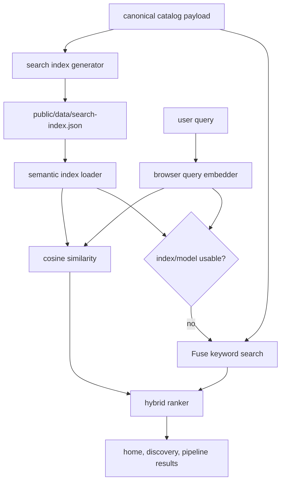
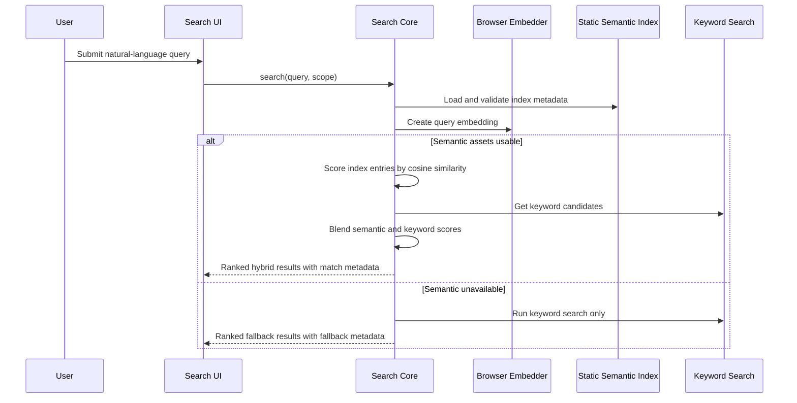

# feat: Add static semantic search

## Summary

Add semantic search to the CEG AI Marketplace without Cloud APIs by combining precomputed catalog/pipeline embeddings, client-side query embedding, and the existing Fuse keyword search as a fallback and ranking stabilizer. The feature should improve natural-language use-case searches on the home page, idea discovery flow, and pipeline catalog while keeping GitHub Pages deployment viable.

---

## Problem Frame

The original Cloud artifact differentiated itself by letting users describe what they wanted to do, then returning the best matching catalog capabilities and in-flight ideas. The current app has the same search entry points, but they are keyword/fuzzy search only. That misses searches where the user's wording differs from the catalog wording, such as "help me prepare for a renewal conversation" versus "AI Renewal Intelligence."

The new architecture is a static Vite React app hosted on GitHub Pages. That rules out direct secret-bearing LLM calls from the browser. The plan therefore uses static assets and browser-side inference for semantic matching, with graceful fallback to the current local search when the embedding model, generated index, or browser capabilities are unavailable.

---

## Requirements

**Search behavior**

- R1. Home search accepts natural-language use-case queries and returns ranked matches across catalog tiles and pipeline ideas.
- R2. Idea discovery search before submission uses semantic matching against catalog tiles so users see existing capabilities before opening the external submission form.
- R3. Pipeline idea search uses the same search core for idea matching while preserving the current status filter behavior.
- R4. Keyword/Fuse search remains available and is used automatically when semantic search cannot run or has weak confidence.
- R5. Results expose enough metadata for the UI to distinguish best matches, good matches, semantic matches, and keyword fallback matches without relying on raw vector scores in the interface.

**Static architecture**

- R6. Catalog and idea embeddings are generated ahead of time into a static JSON asset committed or produced during the update workflow.
- R7. Query embeddings are generated in the browser with an open model/runtime and no Cloud, OpenRouter, or secret-bearing API calls.
- R8. The semantic index includes model metadata and source-data fingerprints so stale or incompatible indexes can be detected and ignored.
- R9. The app continues to work on GitHub Pages if the semantic index file is missing, stale, malformed, or blocked by network/runtime constraints.
- R10. The semantic index is generated from the same catalog/idea payload that production search reads, including any raw GitHub data-branch catalog source used by `DATA_RAW_URL`.

**Maintainability and education**

- R11. Search utilities are testable outside React components, with deterministic tests for scoring, blending, thresholds, and fallback.
- R12. The data update workflow documents how embeddings are regenerated after canonical catalog or idea data changes.
- R13. Project documentation explains semantic search and embeddings in maintainer-friendly terms, including the cost, privacy, performance, and quality trade-offs of this static approach.

---

## High-Level Technical Design

---

## Scope Boundaries

- This plan does not add an LLM answer generator, chat UI, OpenRouter integration, or Cloud API proxy.
- This plan does not add a backend database or shared persistence layer.
- This plan does not require vector database infrastructure; the catalog is small enough for in-browser linear similarity scoring.
- This plan does not expose raw embedding vectors or scores to end users beyond friendly confidence labels.
- Admin UI index regeneration is deferred. The first version should document and script regeneration for maintainers instead.

### Deferred to Follow-Up Work

- Optional LLM reranking or explanation generation via a backend proxy.
- Query analytics to measure no-result searches and tune thresholds.
- Automated CI enforcement that fails when catalog data changes without a refreshed search index.
- Multilingual model evaluation if the marketplace needs non-English search quality.

---

## Key Technical Decisions

- **Use hybrid search rather than replacing Fuse:** Embeddings improve meaning-based retrieval, while Fuse is better for exact names, acronyms, ids, and trigger phrases. Blending the two protects obvious keyword matches and gives semantic search room to surface adjacent capabilities.
- **Precompute item embeddings, compute query embeddings in browser:** Static item vectors keep catalog search fast and compatible with GitHub Pages. The query still needs an embedding at runtime, so the browser lazily loads an open embedding model only when semantic search is used.
- **Prefer a browser-friendly Transformers runtime:** Current Hugging Face Transformers.js documentation describes browser execution without a server, feature-extraction support, quantized model options, and ONNX Runtime usage. Use `@huggingface/transformers` as the preferred candidate unless implementation finds bundle, licensing, or network constraints that make direct ONNX Runtime more suitable.
- **Treat model choice as metadata, not hidden config:** The generated index should record model id, runtime package, embedding dimension, pooling/normalization assumptions, and generated-at timestamp. Search should reject indexes whose metadata does not match the query embedder.
- **Keep similarity scoring local and transparent:** Use cosine similarity over normalized vectors, then map internal scores into friendly confidence bands. Do not invent AI-style prose explanations in this pass.
- **Generate from the live catalog source, not a parallel copy:** Current code contains both `public/data/*.json` files and a `DATA_RAW_URL` raw GitHub catalog payload. The semantic index must fingerprint the payload search actually receives so production does not rank against stale or different records.
- **Use generated static JSON rather than embedding vectors in source modules:** `public/data/search-index.json` or the equivalent data-branch asset keeps large numeric arrays out of app code and lets future update workflows treat embeddings as data.
- **Fail closed into keyword search:** Any semantic load, validation, model, or scoring failure should produce usable keyword results and a non-disruptive fallback indicator for debugging or future telemetry.

---

## Implementation Units

### U1. Define Semantic Index Contract and Generator

**Goal:** Add a maintainable generated index format and generation path for catalog and idea embeddings.

**Requirements:** R6, R8, R10, R12, R13

**Dependencies:** None

**Files:**

- `scripts/generate-search-index.mjs`
- `public/data/search-index.json`
- `src/search-index.js`
- `src/search-index.test.js`
- `src/constants.js`
- `package.json`
- `package-lock.json`
- `README.md`

**Approach:** Create a generator that reads the same canonical catalog/idea payload production uses. If the app continues to load `DATA_RAW_URL` from the raw GitHub data branch, the generator should accept that combined catalog payload shape; if the implementation reverts to separate `public/data/tiles.json` and `public/data/ideas.json` files, the generator should read those files instead. In either case, it converts each tile/idea into a weighted search document, embeds each document with the selected open embedding model, and writes a compact JSON index adjacent to the canonical data asset. The index should include separate entries for catalog tiles and ideas, the source item id, normalized text used for embedding, embedding vector, source fingerprint, generated timestamp, model metadata, and schema version. The app-facing `src/search-index.js` module should validate schema version, metadata compatibility, dimensions, and source fingerprints before allowing semantic search to use the file.

**Patterns to follow:** `src/App.jsx` and `src/constants.js` define the runtime catalog source. Existing docs explain JSON update workflows in `README.md`; extend that pattern rather than inventing a separate operational surface.

**Test scenarios:**

- Given valid tiles and ideas with known generated vectors, when the index validator loads the payload, then it accepts the schema and returns catalog and idea entries grouped by type.
- Given an index with a mismatched schema version, model id, embedding dimension, or source fingerprint, when validation runs, then it marks semantic search unavailable and provides a reason for fallback.
- Given malformed entries with missing ids, non-array embeddings, or inconsistent dimensions, when validation runs, then invalid entries are rejected without breaking keyword search.
- Given a changed tile or idea source fingerprint from the canonical production payload, when validation compares index metadata, then the stale index is ignored.

**Verification:** A generated semantic index asset exists alongside the canonical catalog data, documents its model/schema metadata, and can be validated independently of React rendering.

### U2. Build Hybrid Search Core

**Goal:** Replace page-specific search helpers with a shared hybrid search core that supports semantic scoring, keyword fallback, and result metadata.

**Requirements:** R1, R2, R3, R4, R5, R9, R11

**Dependencies:** U1

**Files:**

- `src/search.js`
- `src/semantic-search.js`
- `src/semantic-search.test.js`
- `src/search.test.js`

**Approach:** Keep the existing `searchTiles` and `searchIdeas` exports working for current callers while adding a unified search API that accepts a query, catalog tiles, ideas, and scope options. The semantic layer should load the validated static index, lazily create a browser query embedding, compute cosine similarity against matching entries, and blend semantic rank with Fuse rank. The fallback path should return Fuse-only results with the same result shape so UI components do not need branching logic for every failure mode.

**Technical design:** Directional scoring shape, not implementation specification:

- Normalize query and reject very short searches before model loading.
- Run Fuse first for immediate fallback candidates and exact/acronym strength.
- Attempt semantic scoring only when index validation succeeds and the query embedder loads.
- Blend normalized semantic and keyword signals, with exact keyword/name hits able to outrank merely related semantic hits.
- Map blended score into confidence labels such as `best`, `good`, `related`, and `fallback`.

**Patterns to follow:** Existing `src/search.js` already centralizes Fuse configuration and result confidence mapping. Preserve that module as the public search boundary rather than spreading scoring logic into pages.

**Test scenarios:**

- Given a query semantically close to an item but without exact shared words, when semantic scoring has a strong cosine match, then the item appears above unrelated keyword-only results.
- Given a query that exactly matches a catalog name, id, or trigger, when both semantic and keyword search run, then the exact keyword match remains near the top.
- Given semantic index validation failure, model load failure, or query embedding failure, when search runs, then Fuse results are returned with fallback metadata and no thrown error.
- Given an empty or one-character query, when search runs, then no model is loaded and no results are returned.
- Given catalog and idea scopes, when unified search runs, then it returns only the requested result types while preserving shared score/confidence fields.
- Given equal semantic scores, when ranking ties are resolved, then deterministic ordering uses keyword rank, status/type priority, or name/title sorting.

**Verification:** Search tests prove semantic, keyword, blended, and fallback paths without depending on a real embedding model by injecting deterministic vectors and model stubs.

### U3. Update Home Search Results Across Catalog and Pipeline

**Goal:** Make the home page search use the hybrid search core across both catalog tiles and pipeline ideas.

**Requirements:** R1, R4, R5

**Dependencies:** U2

**Files:**

- `src/pages/PageHome.jsx`
- `src/components/SNSearchCard.jsx`
- `src/pages/PageHome.test.jsx`

**Approach:** Replace the current synchronous Fuse-only home search with an async search handler that can show the existing loading state while the semantic model loads. Preserve the current result grouping by catalog and pipeline, but update labels to reflect hybrid confidence instead of only "Best match" and "Good match." Keep the no-result path pointing users toward pipeline/submission discovery.

**Patterns to follow:** `SNSearchCard` already supports `loading` and `loadingLabel`, so reuse that contract instead of adding page-specific spinners. Keep home result cards visually consistent with the current compact result list.

**Test scenarios:**

- Given a natural-language query with semantic catalog and idea matches, when the user submits home search, then catalog and pipeline sections render in ranked order with friendly confidence labels.
- Given semantic search falls back to Fuse, when the user searches an exact capability name, then keyword results still render and the UI does not show an error state.
- Given a slow query embedder, when search is pending, then the search button enters the existing loading state and duplicate submits are prevented.
- Given no semantic or keyword matches, when search completes, then the existing no-match/pipeline path remains available.

**Verification:** The home search surface behaves the same for keyword searches and improves for natural-language use-case searches without adding backend calls.

### U4. Update Idea Discovery and Pipeline Search

**Goal:** Apply the shared search core to the idea submission discovery flow and the pipeline idea catalog.

**Requirements:** R2, R3, R4, R5

**Dependencies:** U2

**Files:**

- `src/pages/pipeline/DiscoverySubmit.jsx`
- `src/pages/PageIdeaPortal.jsx`
- `src/pages/pipeline/DiscoverySubmit.test.jsx`
- `src/pages/PageIdeaPortal.test.jsx`

**Approach:** For `DiscoverySubmit`, replace catalog-only Fuse search with hybrid catalog search and preserve the submit-form call to action when no existing capability covers the idea. For `PageIdeaPortal`, replace substring filtering with idea-scoped hybrid search while preserving status filtering as a pre-filter or post-filter decision that keeps user expectations clear. The pipeline page should remain browseable with no query and should not load the embedding model until a meaningful query is submitted or entered, depending on the chosen UX.

**Patterns to follow:** The pipeline page already composes seeded ideas and browser-local submissions into `allIdeas`; search should operate on that composed list. Existing status counts should remain based on the full `allIdeas` set, not only search results.

**Test scenarios:**

- Given a use-case query in idea discovery, when a semantically related catalog tile exists, then the tile appears before the "Submit My Idea" call to action.
- Given no semantic or keyword catalog match in idea discovery, when search completes, then the current "Nothing in the catalog covers this yet" path remains visible.
- Given a pipeline status filter and a search query, when the pipeline catalog renders, then only ideas matching both the status and search criteria appear.
- Given browser-local submitted ideas, when pipeline semantic search runs, then local ideas are included through the same result normalization path or intentionally fall back to keyword if they are not present in the static index.
- Given semantic search is unavailable, when users search pipeline ideas, then current substring/Fuse-like behavior remains functional.

**Verification:** Search behavior is consistent across home, discovery, and pipeline while each page preserves its current navigation and call-to-action behavior.

### U5. Add Documentation, Tuning Notes, and Operational Guardrails

**Goal:** Make the semantic search system understandable and maintainable for future catalog updates.

**Requirements:** R8, R12, R13

**Dependencies:** U1, U2, U3, U4

**Files:**

- `README.md`
- `docs/search.md`
- `package.json`

**Approach:** Document what semantic search and embeddings mean in this project, how the generated index relates to the canonical catalog/idea payload, how to regenerate it, and what fallback states mean. Include tuning guidance for thresholds, result labels, model replacement, stale index detection, and known limitations. Keep the documentation clear that this is not an LLM answer system; it is retrieval by similarity plus keyword fallback.

**Patterns to follow:** Existing `README.md` has concise sections for architecture, checks, and data updates. Add the short operational instructions there and place deeper explanation in `docs/search.md`.

**Test scenarios:**

- Test expectation: none -- documentation and script metadata do not add runtime behavior beyond units already covered by search and index tests.

**Verification:** A maintainer can update catalog/idea data, regenerate embeddings, understand fallback behavior, and explain the trade-offs without reading search internals.

---

## System-Wide Impact

- **Performance:** The first semantic search may download and initialize an embedding model. Lazy loading, quantized model selection, and keyword-first fallback keep the app usable while the model initializes or if it fails.
- **Privacy:** User queries are embedded locally in the browser; the app should not send queries to Cloud, OpenRouter, or a proprietary API. If the model is fetched from a CDN, that network request is for model assets, not query content.
- **Deployment:** GitHub Pages remains viable because all item embeddings are static assets and query embedding runs client-side.
- **Data freshness:** Search quality depends on keeping `search-index.json` aligned with the same catalog and idea payload production loads. Stale detection and documentation are required because this repo currently allows JSON data updates without a backend pipeline.

---

## Risks & Dependencies

- **Model asset size and startup latency:** Browser embedding models can add noticeable first-use cost. Mitigation: lazy load only after meaningful query submission, use quantized models, and show the existing loading state.
- **External model hosting availability:** If the runtime fetches model assets from Hugging Face or another CDN, asset blocking can disable semantic search. Mitigation: preserve Fuse fallback and consider vendoring model assets later if internal access requires it.
- **Search quality tuning:** Cosine thresholds and blend weights will need empirical tuning against marketplace-specific queries. Mitigation: implement deterministic tests for mechanics and add a small manual evaluation checklist in docs.
- **Stale generated index:** Catalog data may change without regenerated embeddings. Mitigation: include source fingerprints and reject stale indexes instead of returning misleading semantic results.
- **Local submissions and admin overrides:** User-local or admin-overridden data may not exist in the static index. Mitigation: merge keyword results for dynamic records and document that semantic quality is strongest for committed static data.

---

## Acceptance Examples

- AE1. Given the query "help me prepare for a renewal conversation," when semantic search is available, then renewal-related capabilities rank above unrelated exact partial matches.
- AE2. Given the query "new account handoff before interlock," when searching from the home page, then both relevant catalog capabilities and pipeline ideas can appear in separate result sections.
- AE3. Given the semantic model fails to load, when a user searches "QBR deck," then keyword/Fuse results still appear without a blocking error.
- AE4. Given the canonical catalog payload changes but `search-index.json` was not regenerated, when the app validates search assets, then semantic search is skipped and keyword fallback is used.
- AE5. Given a pipeline status filter is active, when the user searches pipeline ideas, then results honor both semantic relevance and the selected status.

---

## Documentation / Operational Notes

The implementation should update maintainer docs with a short conceptual explanation:

- Semantic search means matching by meaning instead of only matching shared words.
- Embeddings are numeric vectors representing text meaning.
- The marketplace embeds each catalog tile and idea from the canonical production data payload into a static index.
- At search time, the browser embeds the user's query and compares it to the static item vectors.
- Fuse remains as the keyword fallback and exact-match stabilizer.

The docs should also state that this approach avoids secret-bearing API calls but still has browser model trade-offs: model download size, device performance variance, and occasional semantic false positives.

---

## Sources & Research

- `src/search.js` currently centralizes Fuse search over tiles and ideas and maps Fuse scores to simple confidence labels.
- `src/pages/PageHome.jsx` already searches both catalog and pipeline from the home page and has a TODO for AI-powered semantic search.
- `src/pages/pipeline/DiscoverySubmit.jsx` searches catalog tiles before idea submission and has the same AI-search TODO.
- `src/pages/PageIdeaPortal.jsx` currently filters ideas with plain lowercase substring matching and status filters.
- `README.md` documents the static GitHub Pages architecture and known AI-search limitation.
- `src/constants.js` defines `DATA_RAW_URL`, so implementation must verify whether the production catalog source is the raw GitHub data-branch payload or the separate `public/data/*.json` files before generating embeddings.
- Hugging Face Transformers.js documentation describes browser execution without a server, feature extraction, sentence similarity, ONNX Runtime usage, WebGPU options, and quantized model settings: https://huggingface.co/docs/transformers.js/en/index
- ONNX Runtime Web documentation confirms browser JavaScript usage and supported execution providers, including broadly supported WebAssembly CPU and more limited WebGPU/WebNN paths: https://onnxruntime.ai/docs/get-started/with-javascript/web.html
- Package checks on 2026-05-28 found `@huggingface/transformers` at `4.2.0`, legacy `@xenova/transformers` at `2.17.2`, and `onnxruntime-web` at `1.26.0`; this supports preferring the current Hugging Face package name while keeping the plan model-runtime boundary explicit.
